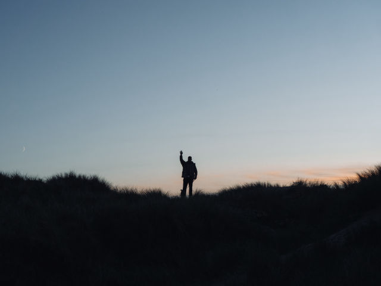

# image-optimize
🖼️ Optimize images in directory by scaling resolution, quality and output format.

### Installing
```shell
# clone repository
git clone https://github.com/pilotpirxie/image-optimize.git

# navigate into directory
cd image-optimise

# install dependencies
yarn
```

### How to use?
Put your images in ``./images`` directory and run:
```shell
yarn run:ts
```

By default it's going to scale down to maximum 1200px width or height. 

If you wish to specify maximum resolution or quality you can use environment variables.

### Environment variables
```shell
# maximum width of image
TARGET_WIDTH=1200

# maximum height of image
TARGET_HEIGHT=1200

# input directory with images
DIR_INPUT="./../images"

# output directory
DIR_OUTPUT="./../images"

# JPEG quality,between 0 and 100
QUALITY=80
```

To use with env variables you can run:
```shell
TARGET_WIDTH=800 TARGET_HEIGHT=480 QUALITY=80 yarn run:ts
```

### Sample
Before 5184x3888 1,67MB

Photo by <a href="https://unsplash.com/@chriscurry92?utm_source=unsplash&utm_medium=referral&utm_content=creditCopyText">Chris Curry</a> on <a href="https://unsplash.com/?utm_source=unsplash&utm_medium=referral&utm_content=creditCopyText">Unsplash</a>

After 640x480 18,22kB

Photo by <a href="https://unsplash.com/@chriscurry92?utm_source=unsplash&utm_medium=referral&utm_content=creditCopyText">Chris Curry</a> on <a href="https://unsplash.com/?utm_source=unsplash&utm_medium=referral&utm_content=creditCopyText">Unsplash</a>

### License
```shell
MIT
```